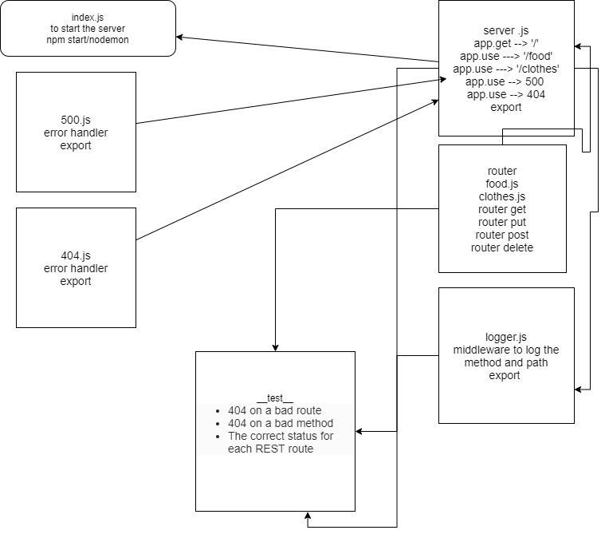

# basic-api-server

## LAB - 03

### Author: Ibrahem Sarayrah

### LINKS

* [github action]()

* [github action test]()

* HEROKU Prod : [https://ibrahem--basic-api-server.herokuapp.com/](https://ibrahem--basic-api-server.herokuapp.com/)

* pull request : [https://github.com/IbrahemSarayrah/basic-api-server/pull/1](https://github.com/IbrahemSarayrah/basic-api-server/pull/1)

### Setup

* **.env** requirements:
>
> PORT=3000
>
> POSTGRES_URI=postgres://localhost/postgres
>

### Running the app

* npm start / nodemon

* Endpoint: `/food`
* Endpoint: `/clothes`

* Returns Objects

```
{
    "clothesType": "shirt",
    "clothesColor": "black"
}

{
    "foodMeal": "pizza",
    "drink": "none",
    "totalPrice":"10"
}
```

### UML


